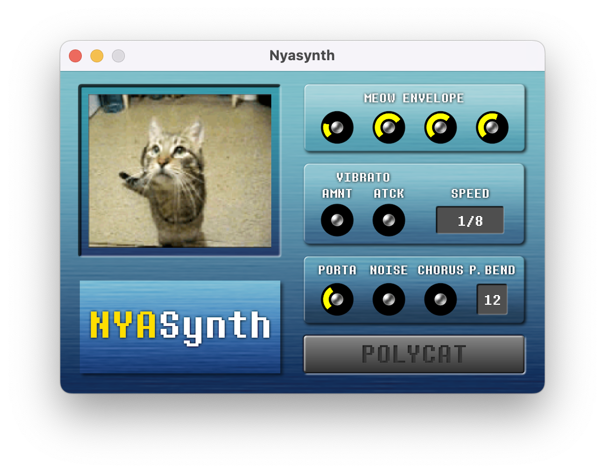

# Nyasynth - The World's Second Meowizer

Do you remember [Meowsynth](https://www.youtube.com/watch?v=_VYtQ9jP73s)? So do I. Unfortunately, it
seems that Meowsynth is only 32-bit and hence isn't compatible with many 64-bit DAWs (in particular,
it's not compatible with Ableton, which doesn't support 32-bit VSTs any more). Additionally, there
isn't a Mac or Linux version. This repo aims to fix that by being a recreation of the synthesizer!



# Download
Download Nyasynth from the [releases page](https://github.com/a2aaron/nyasynth/releases/tag/1.0).
Or click on one of the links below:

[Download for Windows x86-64](https://github.com/a2aaron/nyasynth/releases/download/1.0/Nyasynth.1.0.Windows.x86-64.zip)

[Download for Apple (ARM Binary)](https://github.com/a2aaron/nyasynth/releases/download/1.0/Nyasynth.1.0.Mac.OSX.AArch64.zip)

[Download for Apple (Universal Binary)](https://github.com/a2aaron/nyasynth/releases/download/1.0/Nyasynth.1.0.Mac.OSX.Universal.zip)

(If your platform isn't listed above, you can try compiling from source by following the instructions below.)

# Build Instructions
First, make sure you have [Rust](https://www.rust-lang.org/) installed. You will need to use the nightly version of the compiler, which you can switch to using `rustup default nightly`.

To build the plugin as a vst3 bundle, run the following command:

```
cargo xtask bundle nyasynth --release
```

This will create a `nyasynth.vst3` bundle in `/target/bundled/`. Install this into any DAW of your choice.


You can also create a standalone binary by running the following command:

```
cargo build --release --bin standalone
```

This will create a `standalone` binary in `/target/release/`. You can see the arguments it uses with `standalone -h`. See [nih-plug](https://github.com/robbert-vdh/nih-plug) for more information.